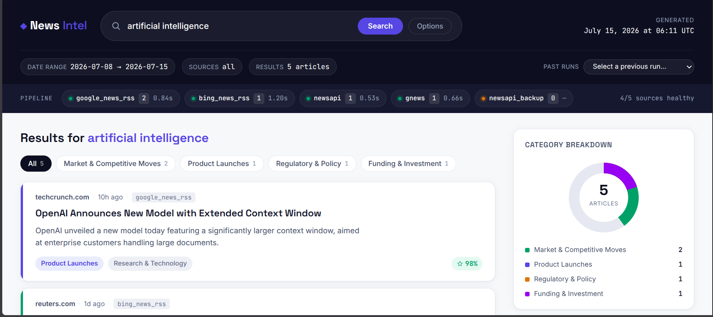
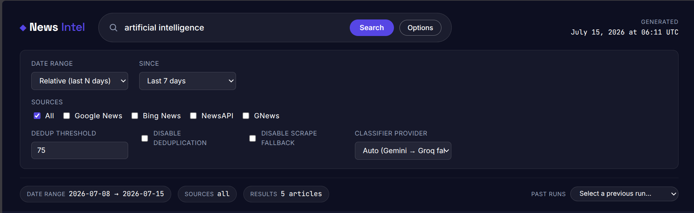
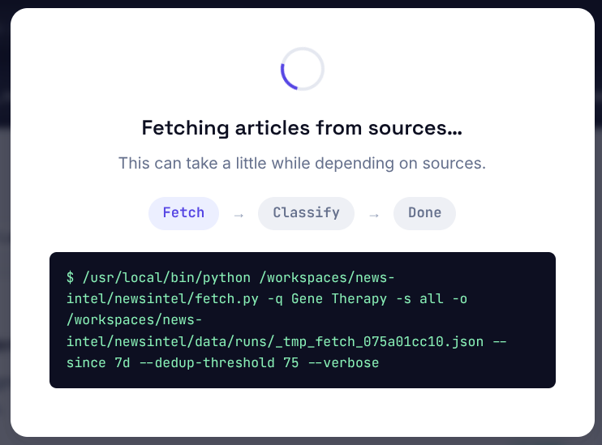
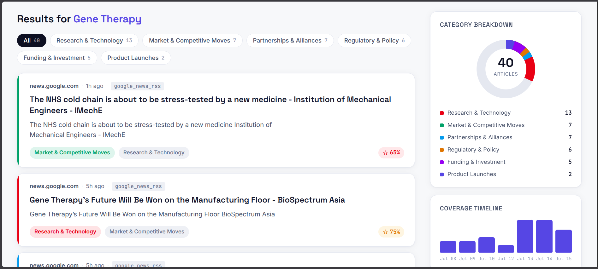

# News Intel
 
Turn a keyword into intelligence feed.
 
Point it at a topic — `"gene therapy"`, `"nvidia"`, `"climate change"` — give it a time window, and it fetches from multiple news sources, collapses duplicate coverage, and sorts everything into categories like funding, partnerships, regulatory updates, and product launches. No manual scanning ten tabs deep at 11pm.
 
Built for tracking fast-moving topics without babysitting an RSS reader.
 
---
 
## Table of Contents
 
- [How it works](#how-it-works)
- [Quickstart](#quickstart)
- [`fetch.py` — pulling articles](#fetchpy--pulling-articles)
- [`classifier.py` — sorting the noise](#classifierpy--sorting-the-noise)
- [`app.py` — the dashboard](#apppy--the-dashboard)
- [Design decisions](#design-decisions--why-it-works-this-way)
- [Limitations](#current-limitations)
- [Roadmap](#roadmap)
- [License](#license)
- [Screenshots](#screenshots)
---
 
## How it works
 
Three components, one pipeline:
 
```
 keyword ──▶ fetch.py ──▶ classifier.py ──▶ app.py
             (sources)     (categorize)      (view)
```
 
1. **`fetch.py`** searches multiple news sources for your keyword within a date range, fuzzy-deduplicates near-identical coverage, and writes the results to JSON.
2. **`classifier.py`** takes that JSON and sorts every article into a category, batching requests to an LLM to keep it fast and cheap rather than burning one API call per article.
3. **`app.py`** serves it all up in a browser dashboard — search, browse by category, drill into individual articles.
Each script also works standalone from the command line — you don't need the dashboard to use the pipeline.
 
---
 
## Quickstart
 
```bash
git clone <repo-url>
cd news-intel
 
python -m venv venv
source venv/bin/activate      # Windows: venv\Scripts\activate
 
pip install -r requirements.txt
 
cp .env.example .env           # then add your own API keys
 
python app.py
```
 
The dashboard opens in your browser. That's it.
 
---
 
## `fetch.py` — pulling articles
 
Searches across sources for a keyword within a date range and exports the combined results as JSON.
 
```bash
python fetch.py --help
```
 
```
usage: fetch.py [-h] -q QUERY [-s SOURCES] [-o OUTPUT] [--since SHORTHAND] [--from DATE]
                 [--to DATE] [--no-scrape-fallback] [--dedup-threshold 0-100]
                 [--dedup-title-weight 0-1] [--dedup-content-weight 0-1] [--no-dedup] [-v]
```
 
**Core options**
 
| Flag | What it does |
|---|---|
| `-q, --query` | Search keyword/query (required). |
| `-s, --sources` | Comma-separated source names, or `all` (default). |
| `-o, --output` | Output JSON path. Default: `fetch_results.json`. |
| `--since` | Relative start date shorthand — `7d`, `14d`, `1m`. |
| `--from` / `--to` | Explicit date range (`YYYY-MM-DD`) or relative shorthand. |
| `--no-scrape-fallback` | Skip fetching full article pages to fill in missing descriptions. |
| `-v, --verbose` | Debug logging. |
 
**Deduplication** (fuzzy matching, on by default):
 
| Flag | What it does |
|---|---|
| `--dedup-threshold` | Similarity score (0–100) to treat two articles as duplicates. Higher = stricter. Default: `75.0`. |
| `--dedup-title-weight` | Weight given to title similarity. Default: `0.7`. |
| `--dedup-content-weight` | Weight given to description/content similarity. Default: `0.3`. |
| `--no-dedup` | Disable deduplication entirely. |
 
**Available sources:** `bing_news_rss`, `gnews`, `google_news_rss`, `newsapi`, `all`
 
**Examples**
 
```bash
python fetch.py -q "climate change" --since 7d
python fetch.py -q "nvidia" --from 2026-06-01 --to 2026-07-01 -s google_news_rss,newsapi
python fetch.py -q "openai" --since 1m -o results/openai.json --verbose
```
 
---
 
## `classifier.py` — sorting the noise
 
Classifies articles from a `fetch.py` JSON output into categories using an LLM.
 
```bash
python classifier.py --help
```
 
```
usage: classifier.py [-h] --input INPUT [--output OUTPUT] [--in-place]
                      [--categories CATEGORIES [CATEGORIES ...]] [--batch-size BATCH_SIZE]
                      [--description-limit DESCRIPTION_LIMIT] [--provider PROVIDER]
```
 
| Flag | What it does |
|---|---|
| `-i, --input` | Path to input JSON (from `fetch.py`). |
| `-o, --output` | Path to write classified output. Required unless `--in-place` is set. |
| `--in-place` | Overwrite the input file instead of writing to `--output`. |
| `-c, --categories` | Custom, space-separated category list (quote multi-word categories). Defaults to a built-in 7-category competitive-intelligence set. |
| `--batch-size` | Articles per classification API call. Default: `10`. |
| `--description-limit` | Max characters of each description sent to the model. `-1` = full text. Default: `500`. |
| `-p, --provider` | Pin to a single provider (e.g. `gemini`, `groq`), skipping the fallback chain — if it fails, the run fails. If omitted, falls back Gemini → Groq. |
 
**Examples**
 
```bash
python classifier.py -i fetch_results.json -o classified.json
python classifier.py -i results/openai.json --in-place -c Funding Partnerships "Regulatory Updates"
python classifier.py -i fetch_results.json -o classified.json --provider gemini --batch-size 15
```
 
---
 
## `app.py` — the dashboard
 
A Flask app that ties `fetch.py` and `classifier.py` together into an interactive UI: search a keyword, watch results populate by category, and browse into individual articles — no CLI required for day-to-day use.
 
```bash
python app.py
```
 
Opens automatically in your browser on a local port.
 
---
 
## Design decisions — why it works this way
 
A few deliberate tradeoffs worth knowing about, since they shape what this tool is (and isn't) good at:
 
- **Batched classification, not per-article calls.** Articles are grouped (default: 10 per batch) into a single LLM call rather than classified one at a time. This is the difference between a tool that's usable at real-world volume and one that isn't — cost and latency scale sublinearly instead of linearly.
- **Description truncation.** Article text is capped (default: 500 characters) before being sent to the classifier. Long articles lose some tail-end context, but this keeps token cost predictable and bounded regardless of article length.
- **Fuzzy dedup over exact matching.** The same story often runs on multiple outlets with slightly different titles and ledes. A weighted similarity score (title-heavy by default) catches these near-duplicates that exact-string matching would miss.
- **Provider fallback chain.** Classification tries Gemini first, then falls back to Groq if that fails — a single provider outage doesn't take the whole pipeline down, unless explicitly pinned with `--provider`.
---
 
## Current limitations
 
- Single default AI provider tier (Gemini free tier) in the fallback chain — more providers can be added.
- No pagination or per-source result caps yet — `fetch.py` returns everything matching the query and date range.
- No advanced query filters yet (must-include / must-exclude terms, boolean search).
- Description truncation can occasionally affect classification accuracy on longer, more nuanced articles.
## Roadmap
 
- **Pagination / per-source limits** — cap results per source (e.g. top 20 from Google News RSS).
- **Advanced filters** — include/exclude terms, boolean search, sort options.
- **`summarizer.py`** *(in progress)* — generates a trend summary per category over the selected window, instead of just listing articles.
- **Broader provider support** — additional LLM providers beyond the current fallback chain.
---
 
## License
 
All rights reserved. See [`LICENSE`](./LICENSE) for terms.
 
## Screenshots





 
 
